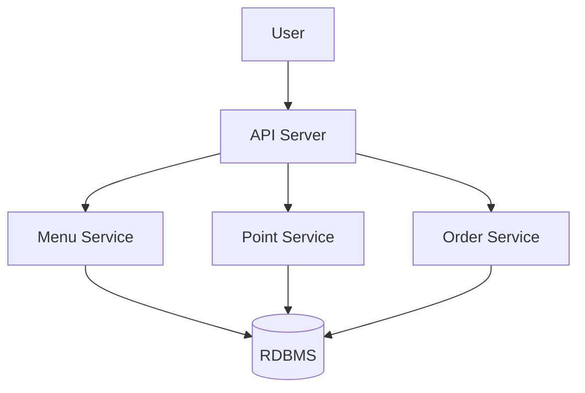
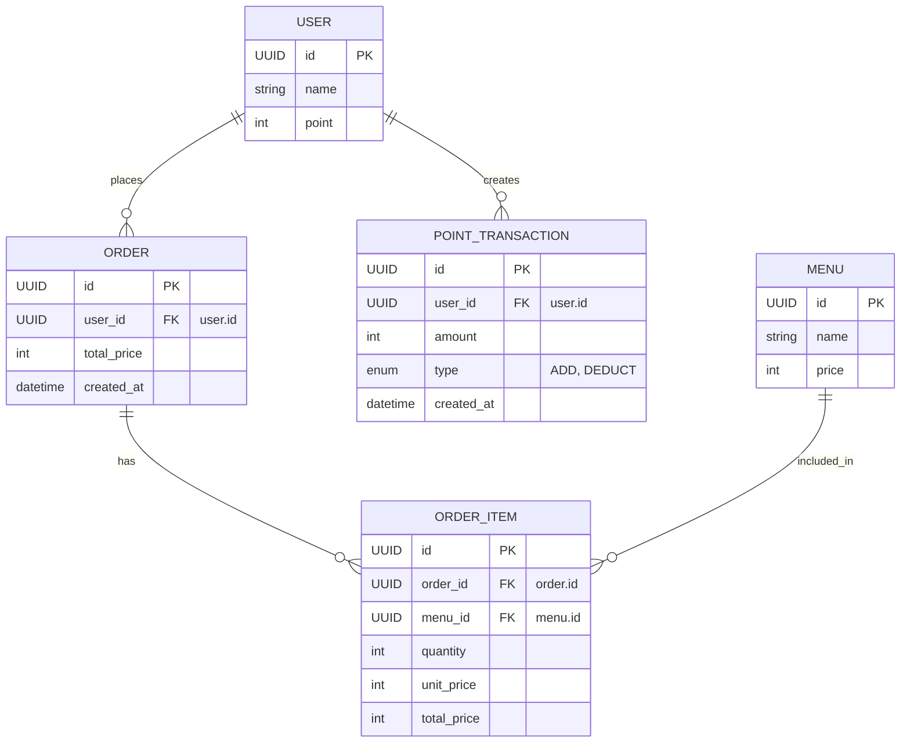

# 📝 Coffee Order System - Tech Spec

## 프로젝트 요약 (Summary)

커피숍 주문 시스템을 설계 및 구현한다. 사용자는 메뉴를 조회하고, 포인트를 충전한 뒤 커피를 주문할 수 있으며, 최근 인기 있는 커피를 조회할 수 있다. 모든 기능은 확장성과 데이터 일관성을 고려하여 설계된다.

---

## 목표 (Goals)

- 커피 메뉴 조회, 포인트 충전, 커피 주문 및 인기 메뉴 조회 API 구현
- 다중 서버 환경에서도 정확하게 동작하는 주문 통계 시스템 구축
- 동시성 및 데이터 정합성 이슈에 대한 견고한 설계
- 유닛 및 통합 테스트를 통한 안정성 확보

---

## 계획 (Plan)

### 1. 시스템 구성도

---

### 2. 도메인 모델 (Entity Relationship Diagram)

---

### 3. API 명세

| API 이름       | 경로                            | 메서드 | 설명                                                      |
| -------------- | ------------------------------- | ------ | --------------------------------------------------------- |
| 커피 메뉴 조회 | `/menus`                        | GET    | 메뉴 ID, 이름, 가격 조회                                  |
| 인기 메뉴 조회 | `/menus/popular`                | GET    | 최근 7일 주문량 기준 Top 3 조회                           |
| 커피 주문/결제 | `/orders`                       | POST   | 주문 및 결제 처리                                         |
| 포인트 충전    | `/users/{userId}/points/charge` | POST   | 포인트 충전 요청 (충전 의미 전달 때문에 동사 charge 사용) |

1. GET /menu
   - 커피 정보(메뉴ID, 이름, 가격)을 조회하는 API를 작성합니다.
2. GET /menu/popular
   - 결제는 포인트로만 가능하며, 포인트를 충전하는 API를 작성합니다.
   - 사용자 식별값, 충전금액을 입력 받아 포인트를 충전합니다. (1원=1P)
3. POST /orders
   - 최근 7일간 인기있는 메뉴 3개를 조회하는 API 작성합니다.
   - 메뉴별 주문 횟수가 정확해야 합니다.
4. POST /user/{user_id}/points/charge
   - 사용자 식별값, 메뉴ID를 입력 받아 주문을 하고 결제를 진행합니다.
   - 결제는 포인트로만 가능하며, 충전한 포인트에서 주문금액을 차감합니다.
   - 주문 내역을 데이터 수집 플랫폼으로 실시간 전송하는 로직을 추가합니다.
     (Mock API 등을 사용하여 사용자 식별값, 메뉴ID, 결제금액을 전송합니다.)

---

### 4. 기술 설계 주요 포인트

#### 🤝 동시성 제어

- 포인트 차감 시 데이터 정합성을 보장하기 위해 DB 레벨 락 또는 Redis 기반 분산 락 사용

#### 📊 인기 메뉴 집계

- 실시간으로 주문 데이터를 Redis Sorted Set에 기록
- 배치 또는 조회 시점에 7일 이내 데이터를 기준으로 정렬 후 상위 3개 추출

#### 📡 실시간 전송 로직

- 주문 성공 시 비동기 방식 (Kafka or Async Queue)으로 외부 API (Mock) 전송
- 실패 시 재시도 큐에 저장하여 재전송 로직 구현 (at-least-once 보장)

---

## 마일스톤 (Milestones)

| issue id | 기간    | 항목                                       | 세부 내용                            |
| -------- | ------- | ------------------------------------------ | ------------------------------------ |
| cf-1     | 2시간   | 요구사항 분석 및 테크 스펙 작성            | API 설계, erd 설계, 핵심 서비스 설계 |
| cf-2     | 1시간   | DB, Redis Docker 세팅                      | 기본 인프라 세팅 + nest js bp 확인   |
| cf-3     | 1.5시간 | TypeORM 모델 세팅                          | nest js bp 확인                      |
| cf-4     | 0.5시간 | 모든 Route Swagger + Controller 작성       | nest js bp 확인                      |
| cf-5     | 0.5시간 | 첫 레포지토리 + 서비스 구현                | nest js bp 확인                      |
| cf-6     | 0.5시간 | 첫 테스팅 구현 + testable code 고민        | nest js bp 확인                      |
| cf-7     | 1.5시간 | 나머지 레포지토리 + 서비스 + 테스팅 마무리 | nest js bp 확인                      |
| cf-8     | 0.5시간 | bp 안맞는 부분 리팩토링                    | nest js bp 확인                      |
| cf-9     | 0.5시간 | e2e happy path 테스팅 구현                 | nest js bp 확인                      |
| cf-10    | 2시간   | 회고 및 nest js 어려운 부분 이해           |                                      |
| cf-11    | 4시간   | (선택) nest js 핵심 기술 딥 다이브         |                                      |

총계 10.5 시간 + (선택 4시간)

---

## 참고 자료

- [뱅크샐러드 테크스펙 문화](https://blog.banksalad.com/tech/we-work-by-tech-spec/)
- [Airbridge API 개발 프로세스](https://engineering.ab180.co/stories/how-engineering-team-works-to-make-robust-product#2ff0f0e7-8c47-4ad8-9e2b-5635b7442d56)
